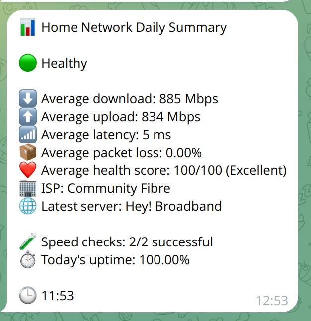
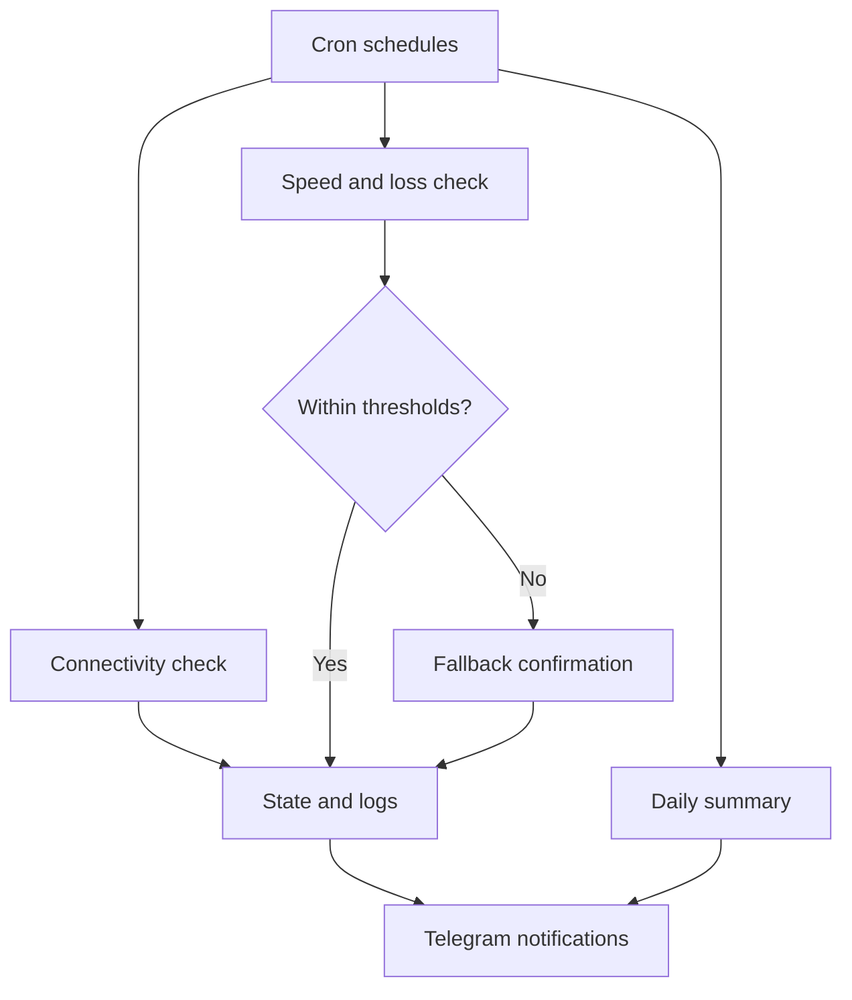

# Home Network Monitor

[](https://github.com/fahimahmeduk/home-network-monitor/actions/workflows/shell-tests.yml)
[](https://github.com/fahimahmeduk/home-network-monitor/releases/tag/v1.3.0)
[](LICENSE)

A lightweight Bash-based monitor for home internet connectivity and performance.

It answers four practical questions:

- Is the internet connection available?
- Have download or upload speeds degraded?
- Is latency or packet loss outside the configured limit?
- What happened while nobody was watching?

Home Network Monitor runs directly on a Linux server, stores human-readable logs and sends useful Telegram notifications. It does not require Docker, a database, a dashboard or any inbound internet access.



## Features

- Connectivity checks every five minutes
- Scheduled download and upload testing
- Primary and fallback speed-test servers
- Same-run confirmation to reduce false alerts
- Latency and ping-based packet-loss reporting
- A transparent Network Health Score from 0 to 100
- Independently verified ISP and test-server reporting
- Degradation and recovery notifications through Telegram
- Daily averages and calculated uptime
- Automatic log rotation and retention
- Safe migration of older CSV logs
- Installer, uninstaller and command-line interface
- Automated simulated tests through GitHub Actions

## How it works



The default schedule is:

| Check | Schedule |
|---|---:|
| Connectivity | Every 5 minutes |
| Speed and network health | 08:00 and 20:00 |
| Daily summary | 20:10 |

The ten-minute gap before the daily summary allows a confirmation speed test to finish.

## Requirements

- A Linux server with Bash
- `curl`
- `jq`
- `ping` from `iputils-ping`
- `cron`
- `flock` from `util-linux`
- [`speedtest-go`](https://github.com/showwin/speedtest-go)
- A Telegram bot token and chat ID

The project is developed and tested on Ubuntu Server.

## Installation

Clone the repository:

```bash
git clone https://github.com/fahimahmeduk/home-network-monitor.git
cd home-network-monitor
```

Run the installer as your normal Linux user:

```bash
./install.sh
```

The installer uses `sudo` only for files under `/opt/home-network-monitor` and `/usr/local/bin`. It installs cron entries for the current user.

Edit the private configuration file:

```bash
sudo nano /opt/home-network-monitor/config.conf
```

Add the Telegram bot token and chat ID, review the thresholds and then test the installation:

```bash
network-monitor test-telegram
network-monitor check
network-monitor speed
network-monitor status
```

> A complete speed test can transfer approximately 1–2 GB. A degraded result can trigger a second confirmation test.

For full instructions, see [Installation](docs/Installation.md) and [Telegram setup](docs/Telegram.md).

## Configuration

The live configuration is stored outside the repository:

```text
/opt/home-network-monitor/config.conf
```

Important defaults include:

```bash
DOWNLOAD_THRESHOLD_MBPS="600"
UPLOAD_THRESHOLD_MBPS="600"
LATENCY_THRESHOLD_MS="30"
PACKET_LOSS_THRESHOLD_PERCENT="2"

SPEEDTEST_SERVER_ID="30690"
SPEEDTEST_FALLBACK_SERVER_ID="54208"

PACKET_LOSS_HOST="8.8.8.8"
CONNECTIVITY_TARGETS="8.8.8.8 1.1.1.1"

ISP_LOOKUP_ENABLED="true"
ISP_LOOKUP_URL="https://ipinfo.io/org"
ISP_NAME_OVERRIDE=""
```

The example speed-test server IDs are UK-based. Users in other locations should select nearby reliable servers.

See [Configuration](docs/Configuration.md) for every option.

## Command-line interface

```text
network-monitor status
network-monitor check
network-monitor speed
network-monitor summary
network-monitor version
network-monitor logs
network-monitor test-telegram
```

Example status:

```text
Home Network Monitor v1.3.0
-----------------------------
Internet state : UP
Speed state    : HEALTHY
Download       : 902.84 Mbps
Upload         : 857.34 Mbps
Latency        : 4.61 ms
Packet loss    : 0.00%
Loss source    : ping:8.8.8.8
Health score   : 100/100
ISP            : Community Fibre
Server         : Hey! Broadband
Attempts       : 2
```

## Network Health Score

The score is deliberately transparent rather than AI-generated. It combines:

| Metric | Weight |
|---|---:|
| Download speed | 30% |
| Upload speed | 30% |
| Latency | 20% |
| Packet loss | 20% |

Each metric is compared with the configured threshold. If packet-loss data is unavailable, the remaining weights are normalised so the score remains usable.

| Score | Rating |
|---:|---|
| 90–100 | Excellent |
| 75–89 | Good |
| 50–74 | Fair |
| 0–49 | Poor |

The health score provides context; the explicit threshold assessment still determines whether a result is `healthy` or `degraded`.

## Logging and data

Runtime data is stored under:

```text
/opt/home-network-monitor/
├── config.conf
├── logs/
│   ├── internet.log
│   └── speed.csv
└── state/
```

Speed results use a documented CSV format containing download, upload, latency, packet loss, Health Score, ISP, server, status, attempts and assessment.

Logs rotate automatically at the configured size and archived logs are retained for 90 days by default. During a schema upgrade, the existing speed log is archived instead of overwritten.

## Reliability safeguards

- Poor speed results are confirmed during the same execution.
- The confirmation test can use a separate server.
- Repeated alerts are suppressed while the state remains unchanged.
- Recovery notifications are sent only after a degraded or error state.
- Concurrent speed tests are prevented with `flock`.
- Connectivity uses more than one target.
- Telegram failures do not stop monitoring or logging.

## Testing

Run the simulated test suite locally:

```bash
tests/run-tests.sh
```

The suite covers:

- Healthy results
- Degraded upload
- Primary-to-fallback recovery
- Speed-test failures
- Packet-loss degradation
- State recovery notifications
- v1.2 log migration
- Daily summaries
- Connectivity outage and restoration
- CLI status and version reporting
- Log rotation

The same suite runs automatically for pushes and pull requests through GitHub Actions.

## Security and privacy

- Telegram credentials are stored only in `/opt/home-network-monitor/config.conf`.
- The configuration file is created with mode `0600`.
- No inbound ports are opened.
- Notifications use outbound HTTPS.
- Public documentation and screenshots must not contain bot tokens, chat IDs or public IP addresses.
- ISP detection uses an outbound HTTPS lookup by default and falls back to Speedtest metadata if that lookup fails.

See [Security](SECURITY.md) for reporting and safe-publication guidance.

## Limitations

- Telegram cannot deliver a live outage message while the internet is unavailable. A restoration message reports the approximate downtime once connectivity returns.
- Speed results depend on the selected test server and current network demand.
- Public ISP databases can occasionally be incorrect; `ISP_NAME_OVERRIDE` provides an explicit local correction.
- ICMP packet-loss checks require a target that responds to ping. The target is configurable.
- This project monitors the internet connection from one Linux host; it is not a replacement for enterprise network observability.

## Documentation

- [Architecture](docs/Architecture.md)
- [Installation](docs/Installation.md)
- [Configuration](docs/Configuration.md)
- [Telegram setup](docs/Telegram.md)
- [Troubleshooting](docs/Troubleshooting.md)
- [Roadmap](docs/Roadmap.md)
- [Changelog](CHANGELOG.md)

## License

This project is available under the [MIT License](LICENSE).
