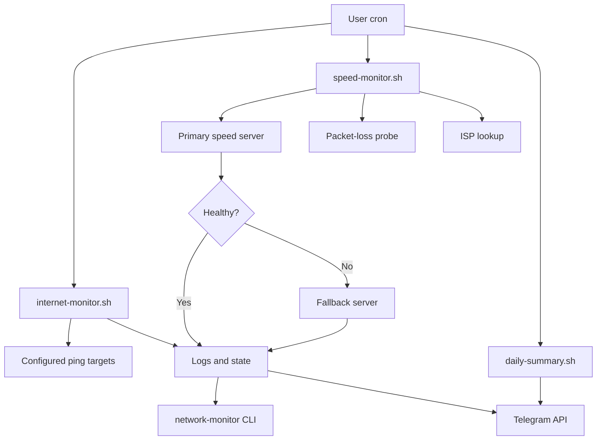

# Architecture

Home Network Monitor is intentionally built from small Bash scripts, cron and flat files. It has no database, daemon, web server or container dependency.

## Components

| Component | Purpose |
|---|---|
| `internet-monitor.sh` | Tests multiple connectivity targets, records state and reports restoration |
| `speed-monitor.sh` | Measures performance, confirms poor results and calculates network health |
| `daily-summary.sh` | Calculates daily averages and uptime, then sends the summary |
| `network-monitor` | Provides the command-line interface |
| `install.sh` | Deploys files, migrates configuration and manages cron entries |
| `uninstall.sh` | Removes the installed application and scheduled entries |

## Runtime flow



## Filesystem layout

```text
/opt/home-network-monitor/
├── VERSION
├── config.conf
├── internet-monitor.sh
├── speed-monitor.sh
├── daily-summary.sh
├── logs/
│   ├── internet.log
│   ├── speed.csv
│   └── rotated archives
└── state/
    ├── internet.state
    ├── internet.target
    ├── outage-start
    ├── speed.state
    └── speed.lock

/usr/local/bin/network-monitor
```

## State model

### Connectivity

- `up`: at least one configured target responded.
- `down`: no configured target responded.
- `unknown`: no previous state exists.

When connectivity changes from `down` to `up`, the stored outage start time is used to calculate approximate downtime.

### Performance

- `healthy`: all available metrics are within thresholds.
- `degraded`: at least one metric remains outside its threshold after confirmation.
- `error`: the speed test failed or returned an invalid result after all attempts.

State changes control notification suppression and recovery messages.

## Confirmation logic

The first scheduled test uses the primary speed-test server. If the result is degraded or fails:

1. The monitor stores the initial assessment.
2. It waits for the configured retry interval.
3. It runs a second test using the fallback server when configured.
4. Only a confirmed degraded/error result changes the state and triggers an alert.

The final CSV record retains the first assessment so the retry is auditable.

## Health Score

The score is a weighted calculation from download, upload, latency and packet loss. It does not replace threshold checks; it provides a readable overall indicator for summaries and trend analysis.

## Logs

Logs are plain text and CSV so they can be inspected with standard Linux tools. Size-based rotation occurs before new entries are written. Archived logs older than the configured retention period are removed automatically.

## Security boundaries

- Secrets exist only in the installed `config.conf`.
- The repository contains placeholders, not credentials.
- All integrations are outbound.
- ISP lookup failure falls back to Speedtest metadata and never prevents a speed result from being logged.
- The monitoring user owns runtime logs, state and configuration.
- Installed scripts are root-owned and executable but do not run as root through cron.
